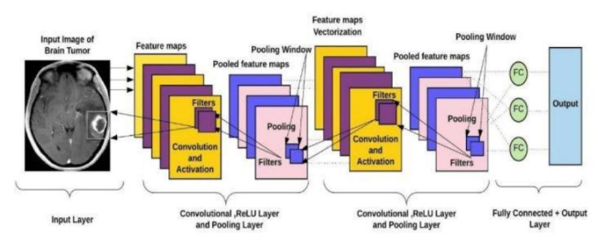

# Brain Tumor Classification using Deep Learning

This project implements a Convolutional Neural Network (CNN) to classify different types of brain tumors from MRI images. 
- The model can distinguish between four categories: glioma, meningioma, no tumor, and pituitary tumors.
- Built using PyTorch to train a custom CNN model for classifying brain tumor MRI images. 
- The model achieves 95.57% accuracy on the test set, making it a reliable tool for preliminary tumor classification.

## Dataset

The dataset consists of MRI scans divided into four categories: 
- Glioma
- Meningioma
- No tumor
- Pituitary tumor

The dataset contains approx. 7,000 images across all categories. 
 
source: https://www.kaggle.com/datasets/masoudnickparvar/brain-tumor-mri-dataset.

## Model Architecture

The CNN model (`TumorClassifier`) consists of:

For feature extraction: 
- 2 Convolution block
- Activation function: ReLU
- Uses max pooling layer

For Classification: 
- 2 fully connected layers

## Training
- Batch Size: 16
- Optimizer: Adam (learning rate = 0.001)
- Loss Function: Cross Entropy Loss
- Early Stopping: Patience of 5 epochs

## Results:
- Accuracy: 95.57%
- Training completed in 20 epochs, early stopping not reached

